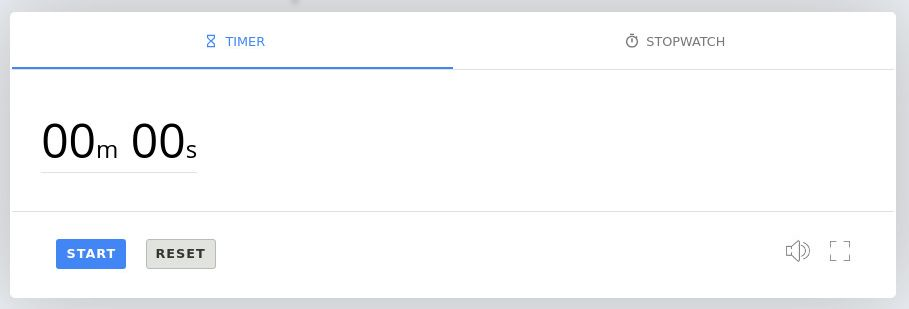

#  Coldtimer
A simple web timer timer users and lovers. I love and use timer for my tasks often. 

## Table Of Contents
   - [Description](#Description)

## Description
This is a learning project. The aim is to ounderstand and practice the Html, Css
and Js fundamentals. I'm inspired by Google Timer which is one of my favorite tool on the internet.
It doesn't not look exactly like the Google one but it's functions are the same.

## Technologies
- HTML: Hypertext Markup Language is the standard markup language for documents designed to 
          be displayed in a web browser
   
- Css:  Cascading Style Sheets is a style sheet language used for describing the presentation 
          of a document written in a markup language like HTML

- Vanilla JS: a plain JavaScript without any additional libraries like jQuery.

   
## Status
***In progress***

## License

](https://opensource.org/licenses/MIT)

## Contact
Created by - https://twitter.com/doni_mbaga
